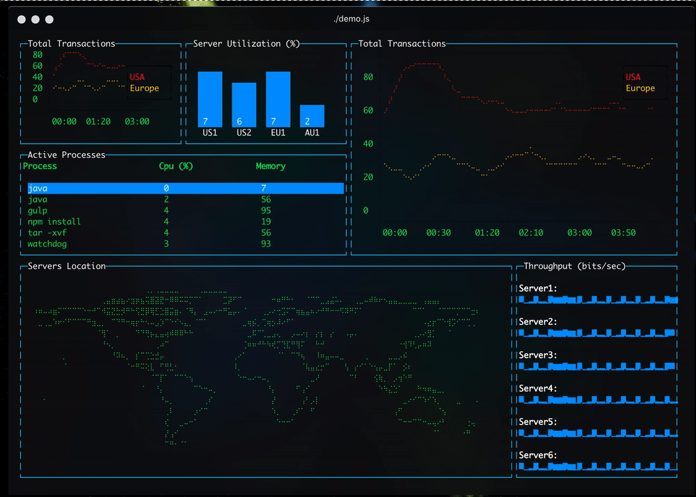

# Angular Terminal Platform

## What is it?

Repository contains demo application that renders full-featured dashboard with charts, maps and tables into system's terminal using Angular! 🔥

## How can I play with it?

- `git clone git@github.com:Tibing/platform-terminal.git`
- `cd platform-terminal`
- `npm install`
- `npm start`
- Enjoy 🌈
